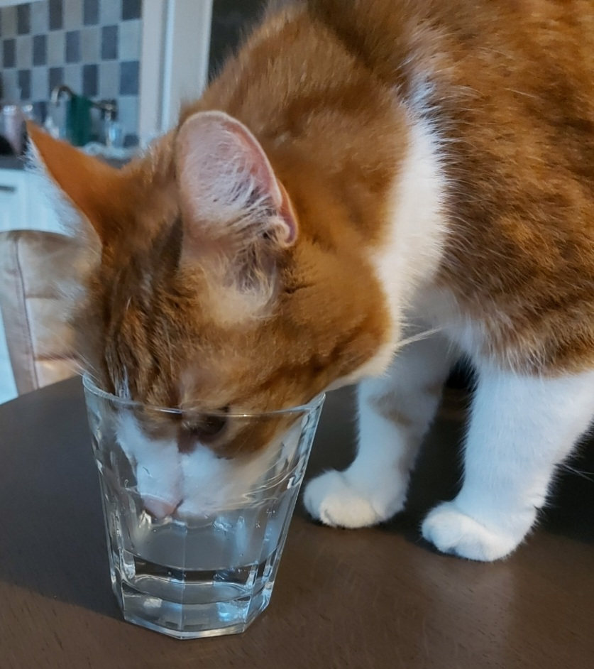

# Reflectieskill

## Romy van den Heuvel

* Wat heb ik met deze lessen nieuw geleerd?  
_Ik heb geleerd hoe ik een github repository clone en veranderingen in het bestand weer terugstuur naar github. Ik heb geleerd hoe commands in de command prompt werken en hoe ik hierin branches maak. Ook heb ik geleerd hoe ik markdown kan toepassen in bijvoorbeeld een README file._

* Wat wist ik al?  
_Ik heb voordat school begon al een keer met github desktop geoefend, dus git commit en git push kwamen me wel bekend voor als termen. Ik snapte er alleen op dat moment nog niet heel veel van._

* Waarvan zou ik nog meer willen weten?  
_Het lijkt me wel interessant om te weten wat ik nog meer in de command prompt kan doen. Verder wil ik ook nog graag leren hoe ik met github desktop kan werken._

## Celine Reijn

   

* wat heb ik met deze les nieuw geleerd?  
>In het algemeen van de lessen van SKILL heb ik veel nieuwe dingen geleerd. Alles was eigenlijk nieuw. Hoe je en repository kan maken, hoe je een branch kan maken en in de branch en de main kom. Ook het CMD is nu duidelijker.

* Wat wist ik al?  
>Zoals ik al zei was alles nieuw, maar na een aantal lessen wist ik wel hoe ik moest clonen, pushen, pullen en een repository kan delen met een klasgenoot. Door het veel te doen leer je heel veel.

* Waarvan zou ik nog meer willen weten?  
>Ik zou niet echt weten wat ik voor de lessen van SKILL nog meer van zou willen weten. Ik wil wel meer gaan coderen, om mijn eigen games te maken of bij te werken.
